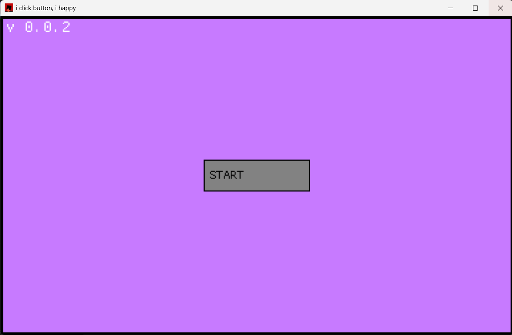

# Simple Menu

[](https://opensource.org/licenses/MIT)

a pretty simple menu you can navigate, it includes a little partical simulator, settings and a starting screen!


---

## Tech Stack

- Language: Rust
- Main libs/frameworks: Macroquad

---

## Features

make sure to watch out for [x] & [ ] in the following list, each box that contains a x is ment to resemble a feature that has been completed while a empty box means it is in planning or in progress! 

- [x] 3 menues you can navigate
- [x] each menu has it`s core features in place ( Start screen with start button, Game screen with partical simulator and the Settings to tweak stuff)
- [ ] making it pretty... it kind of looks like 2001 in a nut shell
- [ ] giving more settings & options for both the Settings & Game tab
- [ ] a game title (i keep forgetting that)

---

### Installation

```bash
# clone the repo
git clone https://github.com/USERNAME/REPO_NAME.git
cd REPO_NAME
